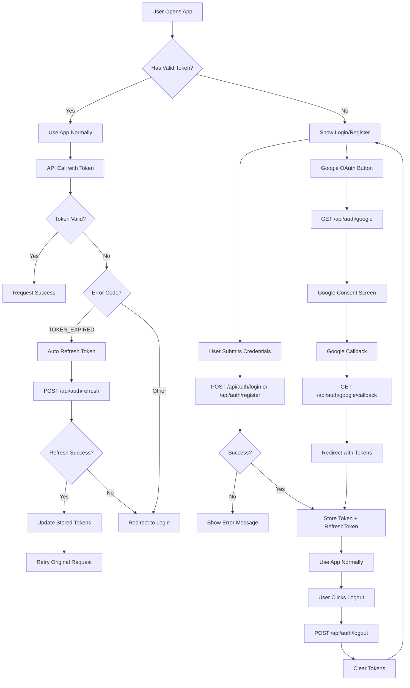
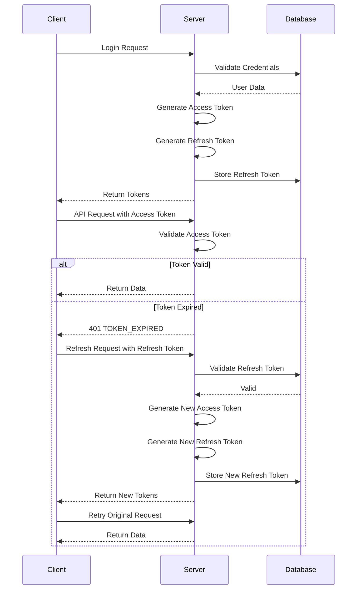

# Authentication System - Updated Documentation

## Overview

The authentication system has been significantly enhanced to provide seamless user experience with automatic token refresh, proper logout functionality, Google OAuth integration, and improved error handling. This document provides comprehensive details for frontend integration.

## Table of Contents

1. [Authentication Flow](#authentication-flow)
2. [API Endpoints](#api-endpoints)
3. [Token Management](#token-management)
4. [Error Handling](#error-handling)
5. [Frontend Integration Guide](#frontend-integration-guide)
6. [Security Considerations](#security-considerations)
7. [Testing Examples](#testing-examples)

---

## Authentication Flow

### Complete User Journey



---

## API Endpoints

### 1. User Registration

**Endpoint:** `POST /api/auth/register`

**Request Body:**

```json
{
  "firstName": "John",
  "lastName": "Doe",
  "email": "john@example.com",
  "password": "password123"
}
```

**Success Response (201):**

```json
{
  "success": true,
  "message": "User registered successfully",
  "user": {
    "id": 1,
    "email": "john@example.com",
    "first_name": "John",
    "last_name": "Doe",
    "role": "customer",
    "created_at": "2025-09-27T17:38:25.816Z"
  },
  "token": "eyJhbGciOiJIUzI1NiIsInR5cCI6IkpXVCJ9...",
  "refreshToken": "a1b2c3d4e5f6g7h8i9j0k1l2m3n4o5p6q7r8s9t0u1v2w3x4y5z6"
}
```

**Error Response (400):**

```json
{
  "success": false,
  "message": "Validation failed",
  "errors": [
    {
      "field": "email",
      "message": "Email is required"
    }
  ]
}
```

### 2. User Login

**Endpoint:** `POST /api/auth/login`

**Request Body:**

```json
{
  "email": "john@example.com",
  "password": "password123"
}
```

**Success Response (200):**

```json
{
  "success": true,
  "message": "Login successful",
  "user": {
    "id": 1,
    "email": "john@example.com",
    "first_name": "John",
    "last_name": "Doe",
    "role": "customer",
    "last_login": "2025-09-27T17:38:25.816Z"
  },
  "token": "eyJhbGciOiJIUzI1NiIsInR5cCI6IkpXVCJ9...",
  "refreshToken": "a1b2c3d4e5f6g7h8i9j0k1l2m3n4o5p6q7r8s9t0u1v2w3x4y5z6"
}
```

**Error Response (400) - OAuth Only Account:**

```json
{
  "success": false,
  "message": "This account was created with Google. Please use 'Sign in with Google' instead.",
  "errorCode": "OAUTH_ONLY_ACCOUNT"
}
```

### 3. Get User Profile

**Endpoint:** `GET /api/auth/profile`

**Headers:**

```
Authorization: Bearer <access_token>
```

**Success Response (200):**

```json
{
  "success": true,
  "message": "Profile retrieved successfully",
  "user": {
    "id": 1,
    "email": "john@example.com",
    "first_name": "John",
    "last_name": "Doe",
    "role": "customer",
    "last_login": "2025-09-27T17:38:25.816Z",
    "oauth_provider": null,
    "profile_picture_url": null,
    "created_at": "2025-09-27T17:38:25.816Z"
  }
}
```

**Error Response (401) - No Token:**

```json
{
  "success": false,
  "message": "Access denied. No token provided.",
  "errorCode": "NO_TOKEN"
}
```

### 4. Refresh Access Token

**Endpoint:** `POST /api/auth/refresh`

**Request Body:**

```json
{
  "refreshToken": "a1b2c3d4e5f6g7h8i9j0k1l2m3n4o5p6q7r8s9t0u1v2w3x4y5z6"
}
```

**Success Response (200):**

```json
{
  "success": true,
  "message": "Token refreshed successfully",
  "token": "eyJhbGciOiJIUzI1NiIsInR5cCI6IkpXVCJ9...",
  "refreshToken": "b2c3d4e5f6g7h8i9j0k1l2m3n4o5p6q7r8s9t0u1v2w3x4y5z6a1"
}
```

**Error Response (401) - Invalid Refresh Token:**

```json
{
  "success": false,
  "message": "Invalid or expired refresh token",
  "errorCode": "INVALID_REFRESH_TOKEN"
}
```

### 5. User Logout

**Endpoint:** `POST /api/auth/logout`

**Request Body:** None required

**Success Response (200):**

```json
{
  "success": true,
  "message": "Logged out successfully"
}
```

### 6. Initiate Google OAuth

**Endpoint:** `GET /api/auth/google`

**Description:** Redirects user to Google OAuth consent screen

**Request:** Browser redirect (no headers/body needed)

**Response:** Redirects to Google OAuth consent screen

**Frontend Integration:**

- Redirect user to this endpoint to initiate Google OAuth
- No headers or body required
- User will be redirected to Google's consent screen

### 7. Google OAuth Callback

**Endpoint:** `GET /api/auth/google/callback`

**Description:** Handles Google OAuth callback (automatically called by Google)

**Request:** Automatically handled by Google OAuth flow

**Success Response:** Redirects to frontend with tokens:

```
http://localhost:3000/auth/callback?token=JWT_TOKEN&refreshToken=REFRESH_TOKEN&success=true
```

**Error Response:** Redirects to frontend with error:

```
http://localhost:3000/login?error=oauth_failed
```

**Frontend Integration:**

- Create a callback page at `/auth/callback` to handle the redirect
- Extract `token` and `refreshToken` from URL parameters
- Store tokens and redirect user to dashboard
- Handle error parameter for failed OAuth attempts

### 8. Get OAuth User Info

**Endpoint:** `GET /api/auth/oauth/user`

**Headers:**

```
Authorization: Bearer <access_token>
```

**Success Response (200):**

```json
{
  "success": true,
  "message": "User info retrieved successfully",
  "user": {
    "id": 12,
    "email": "user@gmail.com",
    "first_name": "John",
    "last_name": "Doe",
    "role": "customer",
    "oauth_provider": "google",
    "profile_picture_url": "https://lh3.googleusercontent.com/a/...",
    "created_at": "2025-09-27T17:38:25.816Z"
  }
}
```

**Error Response (401) - No Token:**

```json
{
  "success": false,
  "message": "Access denied. No token provided.",
  "errorCode": "NO_TOKEN"
}
```

### 9. Request Password Reset

**Endpoint:** `POST /api/auth/forgot-password`

**Request Body:**

```json
{
  "email": "john@example.com"
}
```

**Success Response (200):**

```json
{
  "success": true,
  "message": "If an account with that email exists, a password reset link has been sent."
}
```

**Error Response (400) - OAuth Only Account:**

```json
{
  "success": false,
  "message": "This account was created with Google. Please use 'Sign in with Google' instead.",
  "errorCode": "OAUTH_ONLY_ACCOUNT"
}
```

**Error Response (500) - Email Service Not Configured:**

```json
{
  "success": false,
  "message": "Email service not configured. Please contact support."
}
```

### 10. Verify Reset Token

**Endpoint:** `POST /api/auth/verify-reset-token`

**Request Body:**

```json
{
  "token": "a1b2c3d4e5f6g7h8i9j0k1l2m3n4o5p6q7r8s9t0u1v2w3x4y5z6"
}
```

**Success Response (200):**

```json
{
  "success": true,
  "message": "Reset token is valid",
  "user": {
    "email": "john@example.com",
    "first_name": "John"
  }
}
```

**Error Response (400) - Invalid Token:**

```json
{
  "success": false,
  "message": "Invalid reset token",
  "errorCode": "INVALID_RESET_TOKEN"
}
```

**Error Response (400) - Expired Token:**

```json
{
  "success": false,
  "message": "Reset token has expired",
  "errorCode": "RESET_TOKEN_EXPIRED"
}
```

### 11. Reset Password

**Endpoint:** `POST /api/auth/reset-password`

**Request Body:**

```json
{
  "token": "a1b2c3d4e5f6g7h8i9j0k1l2m3n4o5p6q7r8s9t0u1v2w3x4y5z6",
  "password": "newpassword123"
}
```

**Success Response (200):**

```json
{
  "success": true,
  "message": "Password has been reset successfully. You can now log in with your new password."
}
```

**Error Response (400) - Invalid Token:**

```json
{
  "success": false,
  "message": "Invalid reset token",
  "errorCode": "INVALID_RESET_TOKEN"
}
```

**Error Response (400) - Expired Token:**

```json
{
  "success": false,
  "message": "Reset token has expired",
  "errorCode": "RESET_TOKEN_EXPIRED"
}
```

**Error Response (400) - Validation Error:**

```json
{
  "success": false,
  "message": "Validation failed",
  "errors": [
    {
      "type": "field",
      "msg": "Password must be at least 6 characters long",
      "path": "password",
      "location": "body"
    }
  ]
}
```

---

## Token Management

### Token Types

1. **Access Token (JWT)**

   - Short-lived (24 hours)
   - Used for API authentication
   - Contains user information
   - Automatically refreshed when expired

2. **Refresh Token**
   - Long-lived (7 days)
   - Used to obtain new access tokens
   - Rotated on each refresh for security
   - Stored securely on client side

### Token Lifecycle



### Token Storage Recommendations

**Development:**

- Store in localStorage
- Accessible via JavaScript
- Easy to debug and inspect

**Production:**

- Use httpOnly cookies
- More secure (not accessible via JavaScript)
- Automatic inclusion in requests
- Better protection against XSS

---

## Error Handling

### Error Codes

| Error Code                 | Description                      | Action Required       |
| -------------------------- | -------------------------------- | --------------------- |
| `NO_TOKEN`                 | No authorization header provided | Redirect to login     |
| `TOKEN_EXPIRED`            | Access token has expired         | Attempt token refresh |
| `INVALID_TOKEN_FORMAT`     | Malformed JWT token              | Redirect to login     |
| `TOKEN_NOT_ACTIVE`         | Token not yet active             | Wait and retry        |
| `INVALID_TOKEN`            | Generic invalid token            | Redirect to login     |
| `INSUFFICIENT_PERMISSIONS` | User lacks required role         | Show access denied    |
| `OAUTH_ONLY_ACCOUNT`       | Account created with OAuth only  | Use OAuth login       |
| `INVALID_REFRESH_TOKEN`    | Refresh token invalid/expired    | Redirect to login     |
| `INVALID_RESET_TOKEN`      | Password reset token invalid     | Request new reset     |
| `RESET_TOKEN_EXPIRED`      | Password reset token expired     | Request new reset     |

### Error Handling Implementation

```javascript
function handleAuthError(error, errorCode) {
  switch (errorCode) {
    case "TOKEN_EXPIRED":
      // Attempt automatic refresh
      return attemptTokenRefresh();

    case "NO_TOKEN":
    case "INVALID_TOKEN_FORMAT":
    case "INVALID_TOKEN":
      // Clear tokens and redirect to login
      clearTokens();
      redirectToLogin();
      break;

    case "INSUFFICIENT_PERMISSIONS":
      // Show access denied message
      showAccessDeniedMessage();
      break;

    case "OAUTH_ONLY_ACCOUNT":
      // Show OAuth login option
      showOAuthLoginOption();
      break;

    default:
      // Generic error handling
      showErrorMessage(error.message);
  }
}

function clearTokens() {
  tokenStorage.accessToken = null;
  tokenStorage.refreshToken = null;
  tokenStorage.tokenExpiresAt = null;
  localStorage.removeItem("refreshToken");
}
```

---

## Frontend Integration Guide

This section provides essential information for frontend developers to integrate with the authentication API.

### Key Integration Points

1. **Token Management**: Store and manage access tokens and refresh tokens
2. **Automatic Refresh**: Handle token expiration with automatic refresh
3. **Error Handling**: Handle different authentication error codes
4. **OAuth Flow**: Implement Google OAuth integration
5. **Password Reset**: Implement password reset flow with email verification

### Required Frontend Implementation

#### 1. Token Storage

- Store `accessToken` and `refreshToken` from login/register responses
- Use localStorage for development, httpOnly cookies for production
- Clear tokens on logout

#### 2. API Request Headers

```javascript
headers: {
  'Content-Type': 'application/json',
  'Authorization': `Bearer ${accessToken}`
}
```

#### 3. Error Handling

- Handle `TOKEN_EXPIRED` error code by calling refresh endpoint
- Handle `INVALID_TOKEN` by redirecting to login
- Handle `OAUTH_ONLY_ACCOUNT` for Google-only users

#### 4. Google OAuth Integration

- Redirect to `/api/auth/google` to initiate OAuth
- Create callback page at `/auth/callback` to handle redirect
- Extract tokens from URL parameters on callback

#### 5. Automatic Token Refresh

```javascript
// On 401 error with TOKEN_EXPIRED code
if (errorCode === "TOKEN_EXPIRED") {
  const refreshed = await refreshToken();
  if (refreshed) {
    // Retry original request
  } else {
    // Redirect to login
  }
}
```

#### 6. Password Reset Flow

**Step 1: Request Password Reset**

- Call `/api/auth/forgot-password` with user's email
- Show success message regardless of email existence (security)
- Handle `OAUTH_ONLY_ACCOUNT` error for Google-only users

**Step 2: Verify Reset Token**

- Extract token from email link or URL parameter
- Call `/api/auth/verify-reset-token` to validate token
- Show user info if valid, error message if invalid/expired

**Step 3: Reset Password**

- Call `/api/auth/reset-password` with token and new password
- Handle validation errors for password requirements
- Redirect to login on success

**Error Handling:**

- `INVALID_RESET_TOKEN`: Show "Invalid link" message
- `RESET_TOKEN_EXPIRED`: Show "Link expired" message, offer to resend
- `OAUTH_ONLY_ACCOUNT`: Show "Use Google sign-in" message

### Environment Configuration

Set these environment variables in your frontend:

- `REACT_APP_API_URL` (or equivalent): Backend API URL
- `REACT_APP_GOOGLE_CLIENT_ID`: Google OAuth Client ID (if using Google OAuth)

### Testing

Use the provided cURL commands to verify all endpoints work correctly before implementing frontend integration.

---

## Security Considerations

### Token Security

1. **Access Token Expiration**: 24 hours (configurable)
2. **Refresh Token Expiration**: 7 days (configurable)
3. **Token Rotation**: New refresh token issued on each refresh
4. **Secure Storage**: Store tokens in httpOnly cookies in production
5. **HTTPS Only**: Use HTTPS in production for token transmission

### Best Practices

1. **Error Handling**: Always handle token expiration gracefully
2. **Automatic Refresh**: Implement automatic token refresh on 401 errors
3. **Logout on Refresh Failure**: Clear tokens if refresh fails
4. **CORS Configuration**: Configure CORS properly for your frontend domain
5. **Environment Variables**: Never commit secrets to version control

### Production Checklist

- [ ] Set strong JWT_SECRET and SESSION_SECRET
- [ ] Configure HTTPS
- [ ] Set up proper CORS origins
- [ ] Use httpOnly cookies for token storage
- [ ] Implement rate limiting
- [ ] Set up monitoring and logging
- [ ] Configure Google OAuth for production domain
- [ ] Configure Resend for production domain
- [ ] Test all authentication flows
- [ ] Test password reset flow end-to-end
- [ ] Set up database backups
- [ ] Configure proper error handling

---

## Testing Examples

### cURL Commands

```bash
# 1. Register a new user
curl -X POST http://localhost:5000/api/auth/register \
  -H "Content-Type: application/json" \
  -d '{
    "firstName": "John",
    "lastName": "Doe",
    "email": "john@example.com",
    "password": "password123"
  }'

# 2. Login
curl -X POST http://localhost:5000/api/auth/login \
  -H "Content-Type: application/json" \
  -d '{
    "email": "john@example.com",
    "password": "password123"
  }'

# 3. Get profile (replace TOKEN with actual token)
curl -X GET http://localhost:5000/api/auth/profile \
  -H "Authorization: Bearer TOKEN"

# 4. Refresh token (replace REFRESH_TOKEN with actual refresh token)
curl -X POST http://localhost:5000/api/auth/refresh \
  -H "Content-Type: application/json" \
  -d '{
    "refreshToken": "REFRESH_TOKEN"
  }'

# 5. Logout (replace TOKEN with actual token)
curl -X POST http://localhost:5000/api/auth/logout \
  -H "Authorization: Bearer TOKEN"

# 6. Test Google OAuth (open in browser)
echo "Open this URL in your browser:"
echo "http://localhost:5000/api/auth/google"

# 7. Request password reset
curl -X POST http://localhost:5000/api/auth/forgot-password \
  -H "Content-Type: application/json" \
  -d '{
    "email": "john@example.com"
  }'

# 8. Verify reset token (replace TOKEN with actual reset token from email)
curl -X POST http://localhost:5000/api/auth/verify-reset-token \
  -H "Content-Type: application/json" \
  -d '{
    "token": "RESET_TOKEN_FROM_EMAIL"
  }'

# 9. Reset password (replace TOKEN with actual reset token from email)
curl -X POST http://localhost:5000/api/auth/reset-password \
  -H "Content-Type: application/json" \
  -d '{
    "token": "RESET_TOKEN_FROM_EMAIL",
    "password": "newpassword123"
  }'
```

---

## Troubleshooting

### Common Issues

1. **Token Expired Error**: Implement automatic refresh
2. **CORS Errors**: Check CORS configuration
3. **Google OAuth Redirect Issues**: Verify callback URL configuration
4. **Database Connection**: Check DATABASE_URL environment variable
5. **Missing Environment Variables**: Verify all required variables are set

### Debug Steps

1. Check server logs for detailed error messages
2. Verify environment variables are loaded correctly
3. Test endpoints individually with cURL
4. Check database connection and table structure
5. Verify Google OAuth configuration in Google Cloud Console

---

## Support

For additional support or questions about the authentication system, please refer to:

- [Main Authentication Documentation](./04-authentication.md)
- [Environment Variables Setup](./environment-variables.md)

This documentation provides everything needed to integrate the authentication system into your frontend application.
